# CMLabs CRM Backend - API Flow Diagrams

Dokumen ini berisi flow diagram untuk setiap endpoint yang ada di backend CMLabs CRM.

---

## Table of Contents

1. [Auth Endpoints](#1-auth-endpoints)
2. [Google Auth Endpoints](#2-google-auth-endpoints)
3. [Lead Endpoints](#3-lead-endpoints)
4. [Activity Endpoints](#4-activity-endpoints)
5. [Invoice Endpoints](#5-invoice-endpoints)
6. [Team Endpoints](#6-team-endpoints)
7. [Team Management Endpoints](#7-team-management-endpoints)
8. [Dashboard Endpoints](#8-dashboard-endpoints)
9. [Notification Endpoints](#9-notification-endpoints)
10. [Report Endpoints](#10-report-endpoints)
11. [Profile Endpoints](#11-profile-endpoints)
12. [Custom Field Endpoints](#12-custom-field-endpoints)
13. [Superadmin Endpoints](#13-superadmin-endpoints)
14. [Subscription Endpoints](#14-subscription-endpoints)
15. [Webhook Endpoints](#15-webhook-endpoints)

---

## 1. Auth Endpoints

Base Path: `/api/auth`

### 1.1 Sign Up
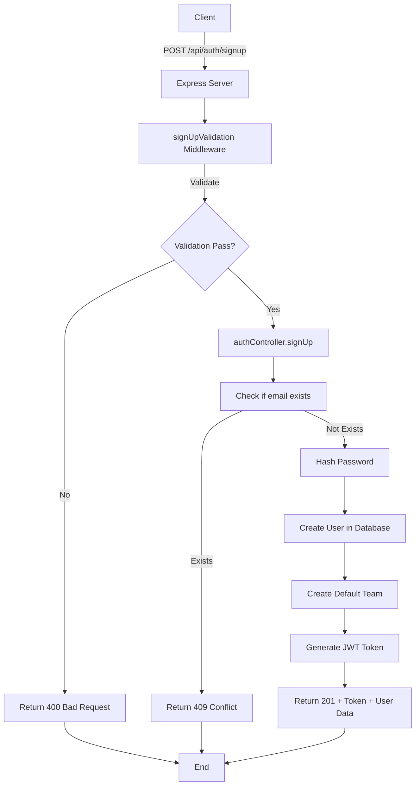
```mermaid
flowchart TD
    A[Client] -->|POST /api/auth/signup| B[Express Server]
    B --> C[signUpValidation Middleware]
    C -->|Validate| D{Validation Pass?}
    D -->|No| E[Return 400 Bad Request]
    D -->|Yes| F[authController.signUp]
    F --> G[Check if email exists]
    G -->|Exists| H[Return 409 Conflict]
    G -->|Not Exists| I[Hash Password]
    I --> J[Create User in Database]
    J --> K[Create Default Team]
    K --> L[Generate JWT Token]
    L --> M[Return 201 + Token + User Data]
    E --> N[End]
    H --> N
    M --> N
```

### 1.2 Sign In
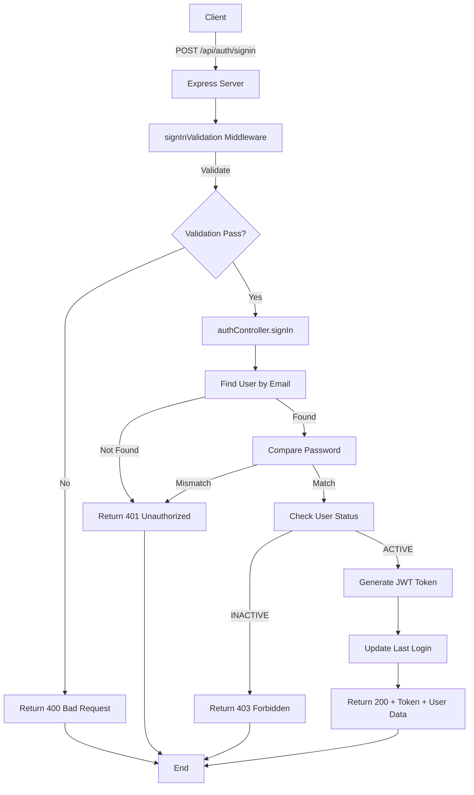
```mermaid
flowchart TD
    A[Client] -->|POST /api/auth/signin| B[Express Server]
    B --> C[signInValidation Middleware]
    C -->|Validate| D{Validation Pass?}
    D -->|No| E[Return 400 Bad Request]
    D -->|Yes| F[authController.signIn]
    F --> G[Find User by Email]
    G -->|Not Found| H[Return 401 Unauthorized]
    G -->|Found| I[Compare Password]
    I -->|Mismatch| H
    I -->|Match| J[Check User Status]
    J -->|INACTIVE| K[Return 403 Forbidden]
    J -->|ACTIVE| L[Generate JWT Token]
    L --> M[Update Last Login]
    M --> N[Return 200 + Token + User Data]
    E --> O[End]
    H --> O
    K --> O
    N --> O
```

### 1.3 Refresh Token
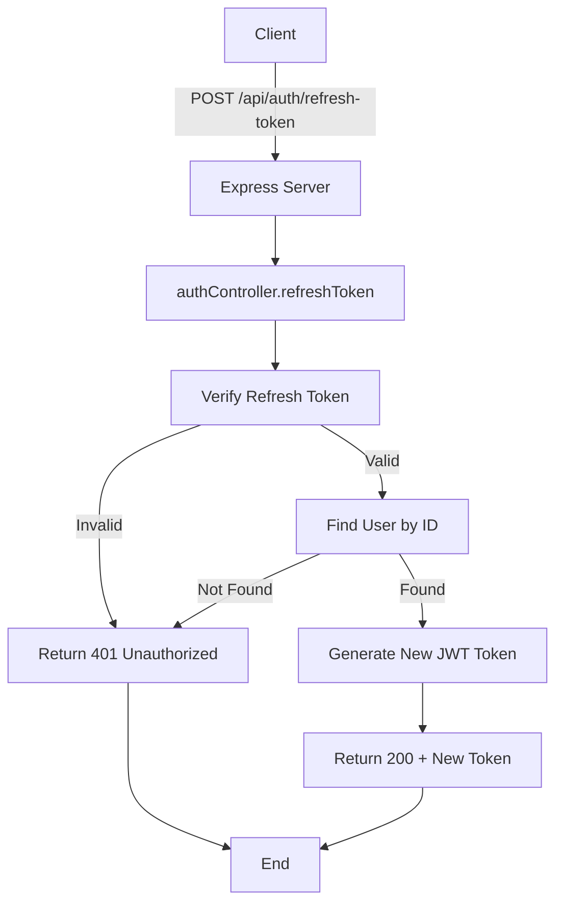
```mermaid
flowchart TD
    A[Client] -->|POST /api/auth/refresh-token| B[Express Server]
    B --> C[authController.refreshToken]
    C --> D[Verify Refresh Token]
    D -->|Invalid| E[Return 401 Unauthorized]
    D -->|Valid| F[Find User by ID]
    F -->|Not Found| E
    F -->|Found| G[Generate New JWT Token]
    G --> H[Return 200 + New Token]
    E --> I[End]
    H --> I
```

### 1.4 Forgot Password
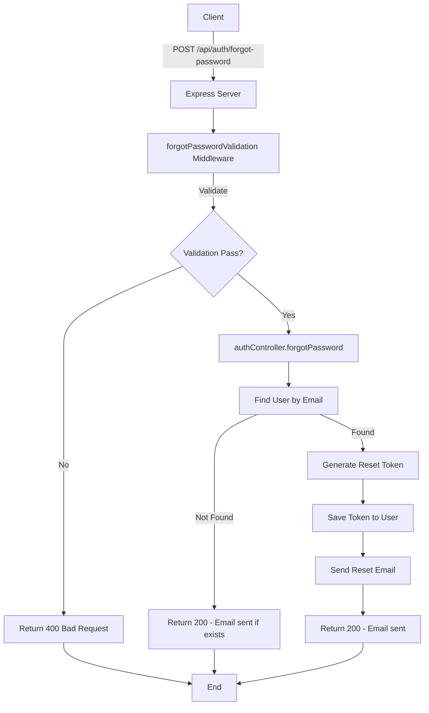
```mermaid
flowchart TD
    A[Client] -->|POST /api/auth/forgot-password| B[Express Server]
    B --> C[forgotPasswordValidation Middleware]
    C -->|Validate| D{Validation Pass?}
    D -->|No| E[Return 400 Bad Request]
    D -->|Yes| F[authController.forgotPassword]
    F --> G[Find User by Email]
    G -->|Not Found| H[Return 200 - Email sent if exists]
    G -->|Found| I[Generate Reset Token]
    I --> J[Save Token to User]
    J --> K[Send Reset Email]
    K --> L[Return 200 - Email sent]
    E --> M[End]
    H --> M
    L --> M
```

### 1.5 Reset Password
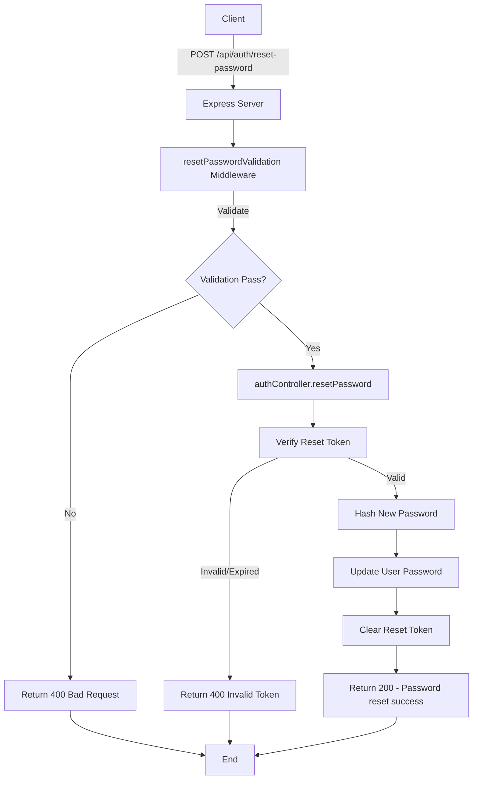
```mermaid
flowchart TD
    A[Client] -->|POST /api/auth/reset-password| B[Express Server]
    B --> C[resetPasswordValidation Middleware]
    C -->|Validate| D{Validation Pass?}
    D -->|No| E[Return 400 Bad Request]
    D -->|Yes| F[authController.resetPassword]
    F --> G[Verify Reset Token]
    G -->|Invalid/Expired| H[Return 400 Invalid Token]
    G -->|Valid| I[Hash New Password]
    I --> J[Update User Password]
    J --> K[Clear Reset Token]
    K --> L[Return 200 - Password reset success]
    E --> M[End]
    H --> M
    L --> M
```

### 1.6 Logout
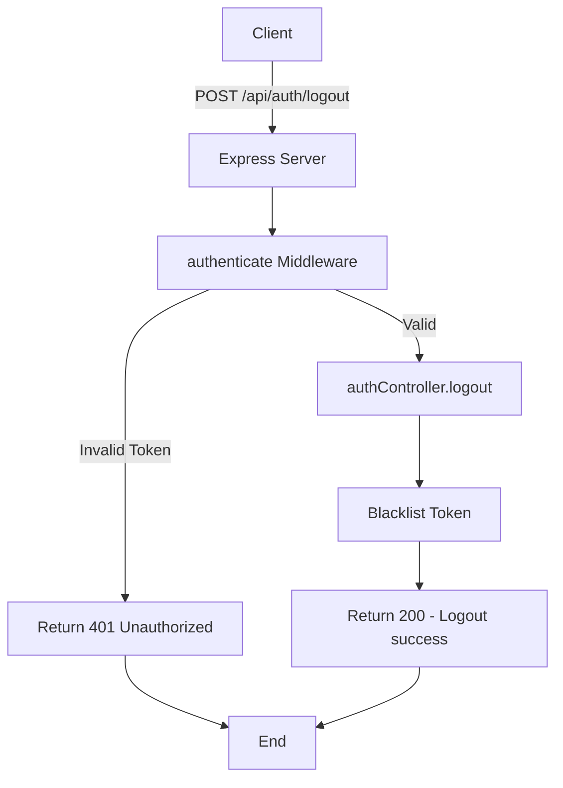
```mermaid
flowchart TD
    A[Client] -->|POST /api/auth/logout| B[Express Server]
    B --> C[authenticate Middleware]
    C -->|Invalid Token| D[Return 401 Unauthorized]
    C -->|Valid| E[authController.logout]
    E --> F[Blacklist Token]
    F --> G[Return 200 - Logout success]
    D --> H[End]
    G --> H
```

### 1.7 Get Current User (Me)
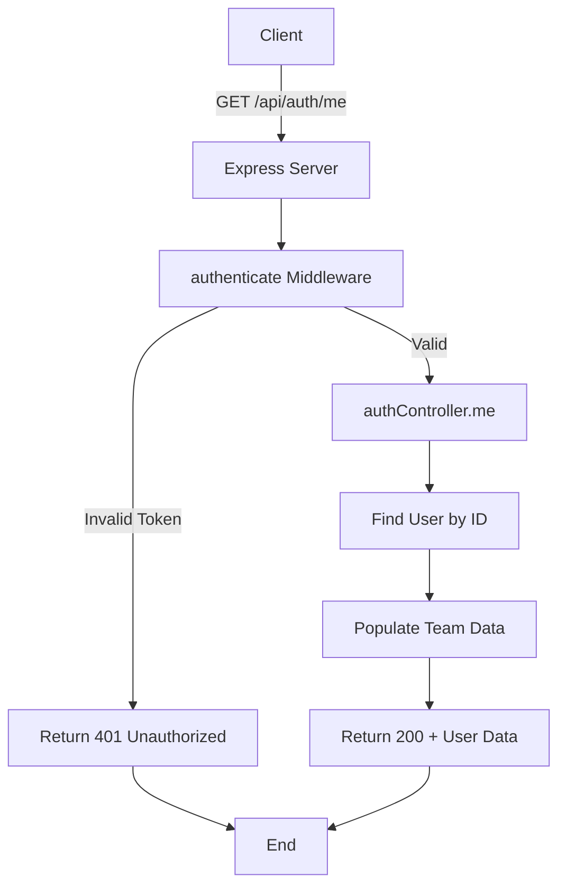
```mermaid
flowchart TD
    A[Client] -->|GET /api/auth/me| B[Express Server]
    B --> C[authenticate Middleware]
    C -->|Invalid Token| D[Return 401 Unauthorized]
    C -->|Valid| E[authController.me]
    E --> F[Find User by ID]
    F --> G[Populate Team Data]
    G --> H[Return 200 + User Data]
    D --> I[End]
    H --> I
```

---

## 2. Google Auth Endpoints

Base Path: `/api/google`

### 2.1 Get Google Auth URL
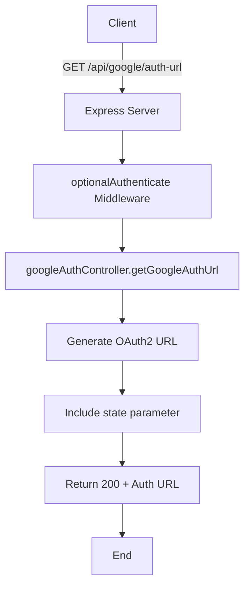
```mermaid
flowchart TD
    A[Client] -->|GET /api/google/auth-url| B[Express Server]
    B --> C[optionalAuthenticate Middleware]
    C --> D[googleAuthController.getGoogleAuthUrl]
    D --> E[Generate OAuth2 URL]
    E --> F[Include state parameter]
    F --> G[Return 200 + Auth URL]
    G --> H[End]
```

### 2.2 Handle Google Callback
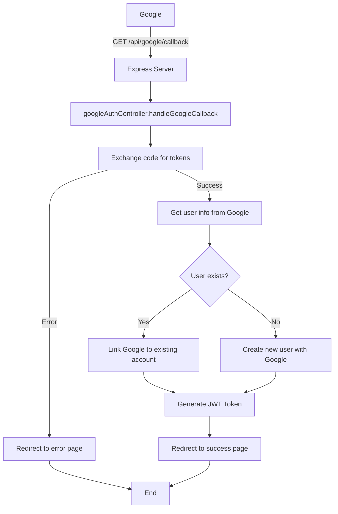
```mermaid
flowchart TD
    A[Google] -->|GET /api/google/callback| B[Express Server]
    B --> C[googleAuthController.handleGoogleCallback]
    C --> D[Exchange code for tokens]
    D -->|Error| E[Redirect to error page]
    D -->|Success| F[Get user info from Google]
    F --> G{User exists?}
    G -->|Yes| H[Link Google to existing account]
    G -->|No| I[Create new user with Google]
    H --> J[Generate JWT Token]
    I --> J
    J --> K[Redirect to success page]
    E --> L[End]
    K --> L
```

### 2.3 Get Google Link Status
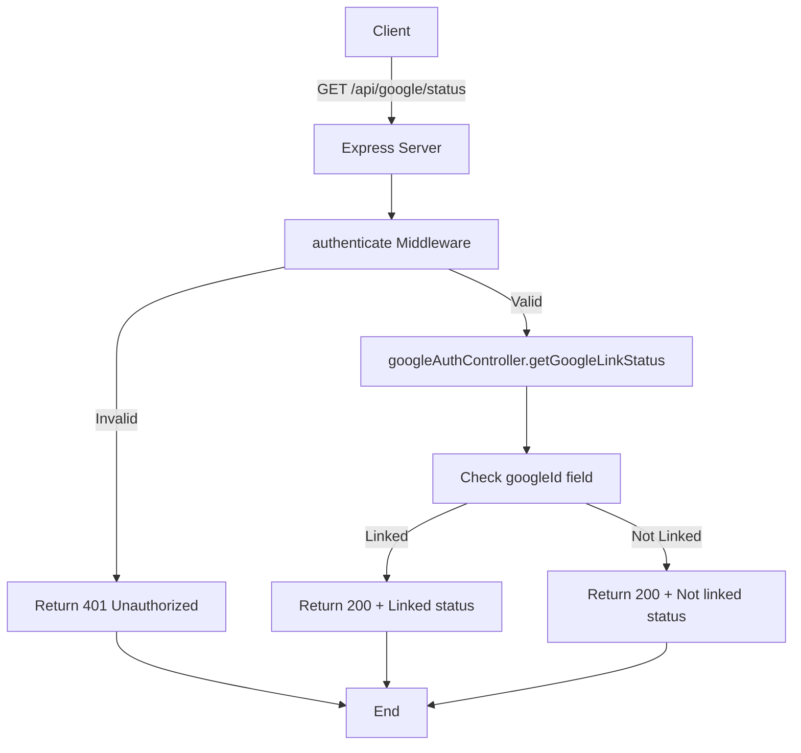
```mermaid
flowchart TD
    A[Client] -->|GET /api/google/status| B[Express Server]
    B --> C[authenticate Middleware]
    C -->|Invalid| D[Return 401 Unauthorized]
    C -->|Valid| E[googleAuthController.getGoogleLinkStatus]
    E --> F[Check googleId field]
    F -->|Linked| G[Return 200 + Linked status]
    F -->|Not Linked| H[Return 200 + Not linked status]
    D --> I[End]
    G --> I
    H --> I
```

### 2.4 Unlink Google Account
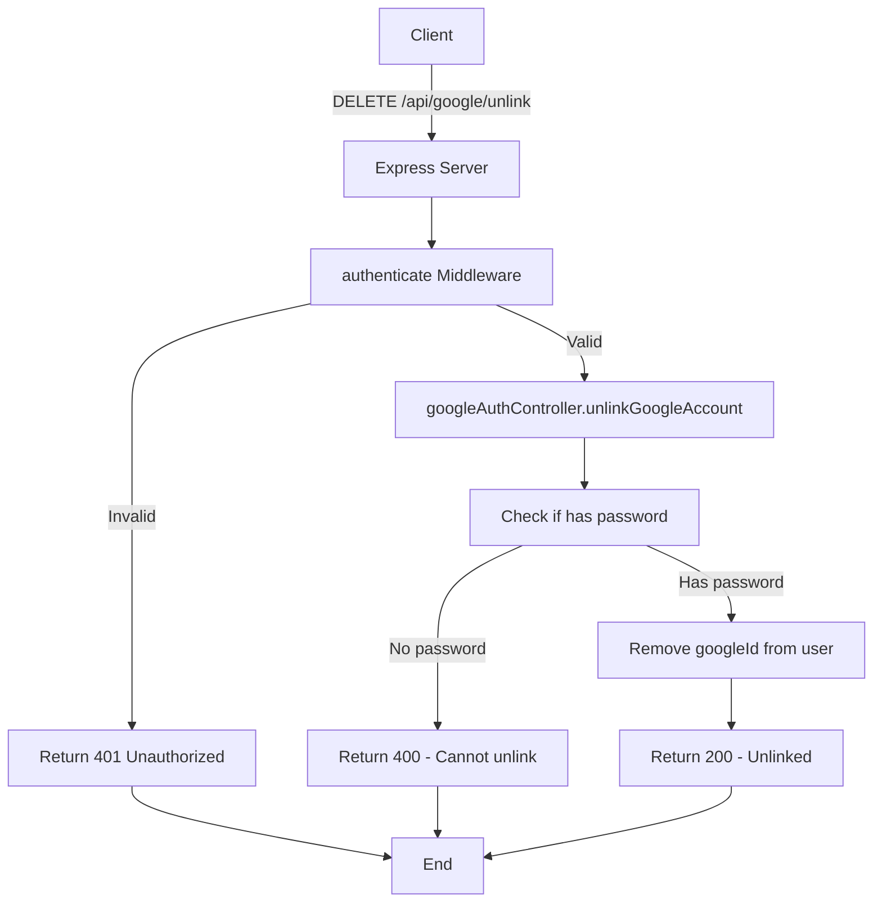
```mermaid
flowchart TD
    A[Client] -->|DELETE /api/google/unlink| B[Express Server]
    B --> C[authenticate Middleware]
    C -->|Invalid| D[Return 401 Unauthorized]
    C -->|Valid| E[googleAuthController.unlinkGoogleAccount]
    E --> F[Check if has password]
    F -->|No password| G[Return 400 - Cannot unlink]
    F -->|Has password| H[Remove googleId from user]
    H --> I[Return 200 - Unlinked]
    D --> J[End]
    G --> J
    I --> J
```

---

## 3. Lead Endpoints

Base Path: `/api/leads`
All routes require: `authenticate` + `withTeamContext`

### 3.1 Get All Leads
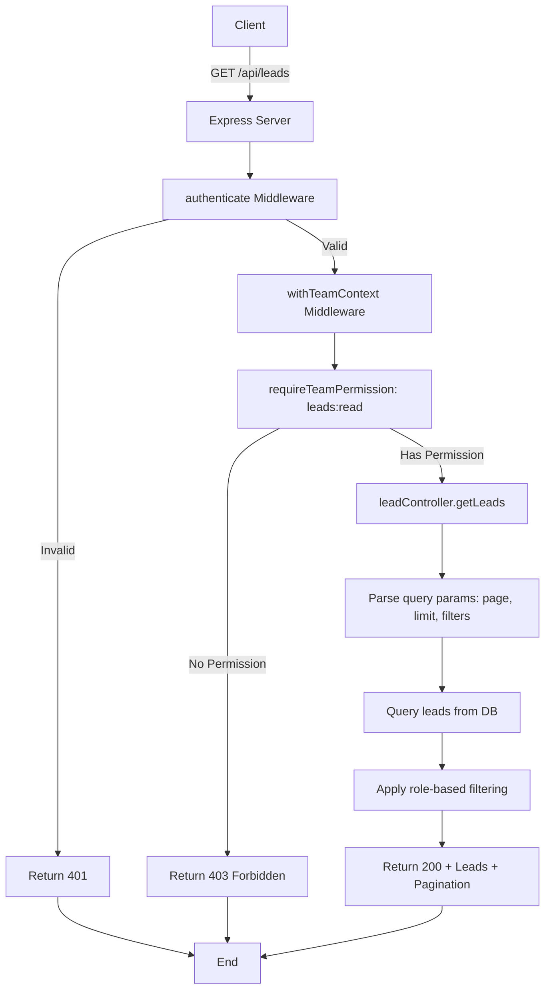
```mermaid
flowchart TD
    A[Client] -->|GET /api/leads| B[Express Server]
    B --> C[authenticate Middleware]
    C -->|Invalid| D[Return 401]
    C -->|Valid| E[withTeamContext Middleware]
    E --> F[requireTeamPermission: leads:read]
    F -->|No Permission| G[Return 403 Forbidden]
    F -->|Has Permission| H[leadController.getLeads]
    H --> I[Parse query params: page, limit, filters]
    I --> J[Query leads from DB]
    J --> K[Apply role-based filtering]
    K --> L[Return 200 + Leads + Pagination]
    D --> M[End]
    G --> M
    L --> M
```

### 3.2 Get Leads Kanban
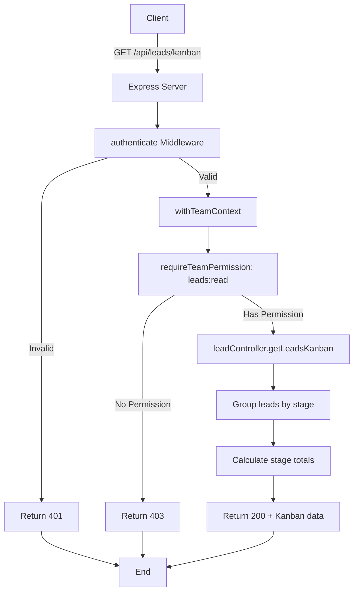
```mermaid
flowchart TD
    A[Client] -->|GET /api/leads/kanban| B[Express Server]
    B --> C[authenticate Middleware]
    C -->|Invalid| D[Return 401]
    C -->|Valid| E[withTeamContext]
    E --> F[requireTeamPermission: leads:read]
    F -->|No Permission| G[Return 403]
    F -->|Has Permission| H[leadController.getLeadsKanban]
    H --> I[Group leads by stage]
    I --> J[Calculate stage totals]
    J --> K[Return 200 + Kanban data]
    D --> L[End]
    G --> L
    K --> L
```

### 3.3 Search Leads
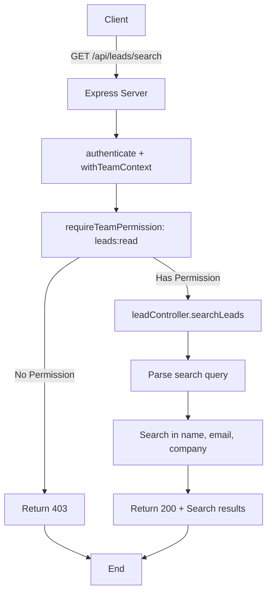
```mermaid
flowchart TD
    A[Client] -->|GET /api/leads/search| B[Express Server]
    B --> C[authenticate + withTeamContext]
    C --> D[requireTeamPermission: leads:read]
    D -->|No Permission| E[Return 403]
    D -->|Has Permission| F[leadController.searchLeads]
    F --> G[Parse search query]
    G --> H[Search in name, email, company]
    H --> I[Return 200 + Search results]
    E --> J[End]
    I --> J
```

### 3.4 Create Lead
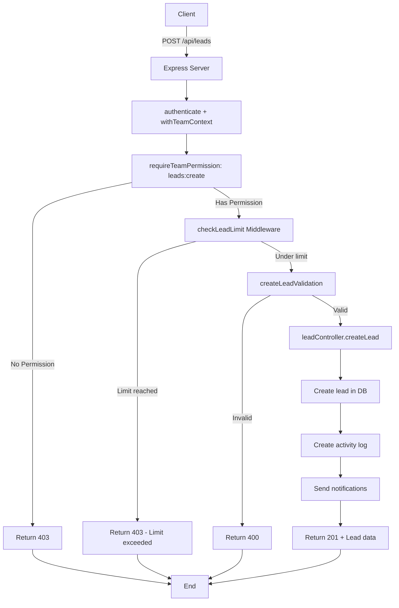
```mermaid
flowchart TD
    A[Client] -->|POST /api/leads| B[Express Server]
    B --> C[authenticate + withTeamContext]
    C --> D[requireTeamPermission: leads:create]
    D -->|No Permission| E[Return 403]
    D -->|Has Permission| F[checkLeadLimit Middleware]
    F -->|Limit reached| G[Return 403 - Limit exceeded]
    F -->|Under limit| H[createLeadValidation]
    H -->|Invalid| I[Return 400]
    H -->|Valid| J[leadController.createLead]
    J --> K[Create lead in DB]
    K --> L[Create activity log]
    L --> M[Send notifications]
    M --> N[Return 201 + Lead data]
    E --> O[End]
    G --> O
    I --> O
    N --> O
```

### 3.5 Get Single Lead
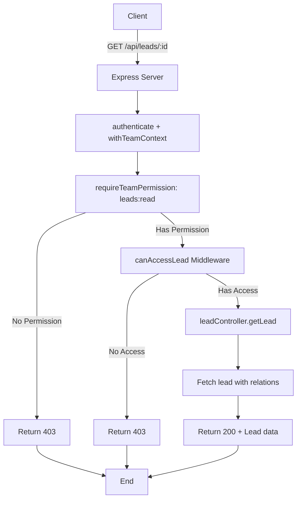
```mermaid
flowchart TD
    A[Client] -->|GET /api/leads/:id| B[Express Server]
    B --> C[authenticate + withTeamContext]
    C --> D[requireTeamPermission: leads:read]
    D -->|No Permission| E[Return 403]
    D -->|Has Permission| F[canAccessLead Middleware]
    F -->|No Access| G[Return 403]
    F -->|Has Access| H[leadController.getLead]
    H --> I[Fetch lead with relations]
    I --> J[Return 200 + Lead data]
    E --> K[End]
    G --> K
    J --> K
```

### 3.6 Update Lead
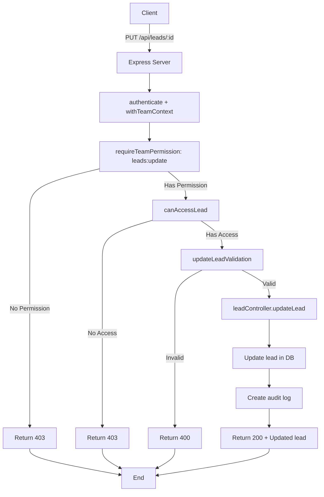
```mermaid
flowchart TD
    A[Client] -->|PUT /api/leads/:id| B[Express Server]
    B --> C[authenticate + withTeamContext]
    C --> D[requireTeamPermission: leads:update]
    D -->|No Permission| E[Return 403]
    D -->|Has Permission| F[canAccessLead]
    F -->|No Access| G[Return 403]
    F -->|Has Access| H[updateLeadValidation]
    H -->|Invalid| I[Return 400]
    H -->|Valid| J[leadController.updateLead]
    J --> K[Update lead in DB]
    K --> L[Create audit log]
    L --> M[Return 200 + Updated lead]
    E --> N[End]
    G --> N
    I --> N
    M --> N
```

### 3.7 Update Lead Stage
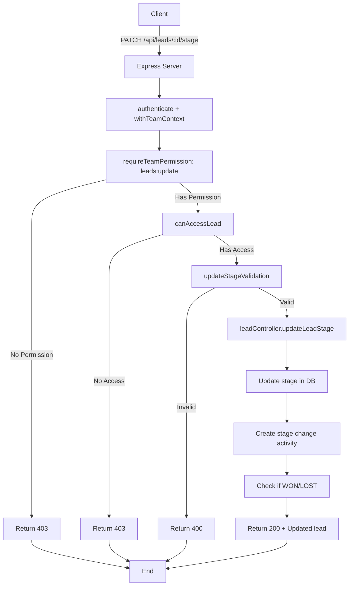
```mermaid
flowchart TD
    A[Client] -->|PATCH /api/leads/:id/stage| B[Express Server]
    B --> C[authenticate + withTeamContext]
    C --> D[requireTeamPermission: leads:update]
    D -->|No Permission| E[Return 403]
    D -->|Has Permission| F[canAccessLead]
    F -->|No Access| G[Return 403]
    F -->|Has Access| H[updateStageValidation]
    H -->|Invalid| I[Return 400]
    H -->|Valid| J[leadController.updateLeadStage]
    J --> K[Update stage in DB]
    K --> L[Create stage change activity]
    L --> M[Check if WON/LOST]
    M --> N[Return 200 + Updated lead]
    E --> O[End]
    G --> O
    I --> O
    N --> O
```

### 3.8 Delete Lead
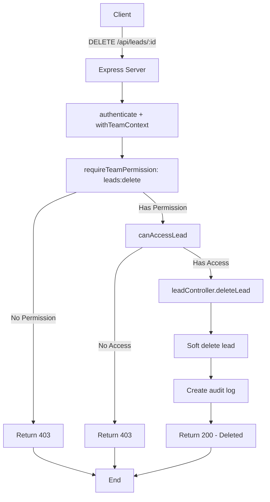
```mermaid
flowchart TD
    A[Client] -->|DELETE /api/leads/:id| B[Express Server]
    B --> C[authenticate + withTeamContext]
    C --> D[requireTeamPermission: leads:delete]
    D -->|No Permission| E[Return 403]
    D -->|Has Permission| F[canAccessLead]
    F -->|No Access| G[Return 403]
    F -->|Has Access| H[leadController.deleteLead]
    H --> I[Soft delete lead]
    I --> J[Create audit log]
    J --> K[Return 200 - Deleted]
    E --> L[End]
    G --> L
    K --> L
```

### 3.9 Bulk Action
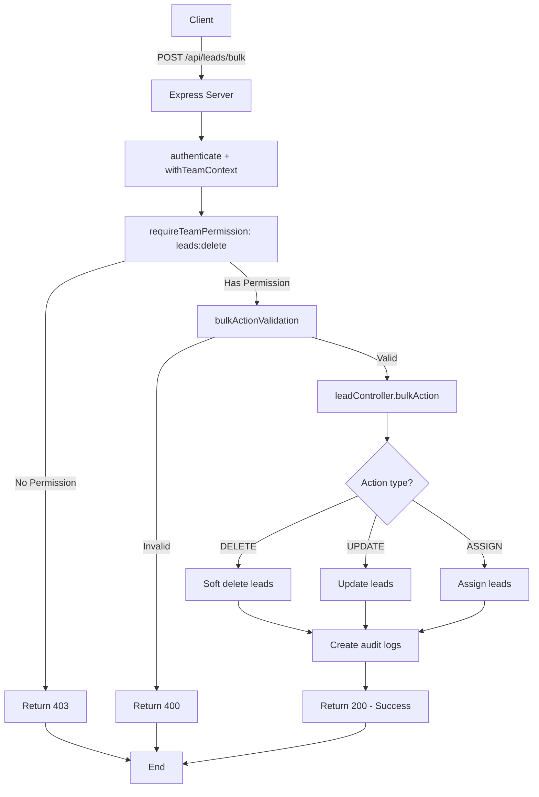
```mermaid
flowchart TD
    A[Client] -->|POST /api/leads/bulk| B[Express Server]
    B --> C[authenticate + withTeamContext]
    C --> D[requireTeamPermission: leads:delete]
    D -->|No Permission| E[Return 403]
    D -->|Has Permission| F[bulkActionValidation]
    F -->|Invalid| G[Return 400]
    F -->|Valid| H[leadController.bulkAction]
    H --> I{Action type?}
    I -->|DELETE| J[Soft delete leads]
    I -->|UPDATE| K[Update leads]
    I -->|ASSIGN| L[Assign leads]
    J --> M[Create audit logs]
    K --> M
    L --> M
    M --> N[Return 200 - Success]
    E --> O[End]
    G --> O
    N --> O
```

---

## 4. Activity Endpoints

Base Path: `/api/activities`
All routes require: `authenticate` + `withTeamContext`

### 4.1 Get Activities by Lead
```mermaid
flowchart TD
    A[Client] -->|GET /api/activities/:leadId/activities| B[Express Server]
    B --> C[authenticate + withTeamContext]
    C --> D[canAccessLeadByLeadId]
    D -->|No Access| E[Return 403]
    D -->|Has Access| F[activityController.getActivities]
    F --> G[Fetch activities from DB]
    G --> H[Return 200 + Activities]
    E --> I[End]
    H --> I
```

### 4.2 Get Timeline by Lead
```mermaid
flowchart TD
    A[Client] -->|GET /api/activities/:leadId/timeline| B[Express Server]
    B --> C[authenticate + withTeamContext]
    C --> D[canAccessLeadByLeadId]
    D -->|No Access| E[Return 403]
    D -->|Has Access| F[activityController.getTimeline]
    F --> G[Fetch timeline events]
    G --> H[Sort by timestamp]
    H --> I[Return 200 + Timeline]
    E --> J[End]
    I --> J
```

### 4.3 Get Notes by Lead
```mermaid
flowchart TD
    A[Client] -->|GET /api/activities/:leadId/notes| B[Express Server]
    B --> C[authenticate + withTeamContext]
    C --> D[canAccessLeadByLeadId]
    D -->|No Access| E[Return 403]
    D -->|Has Access| F[activityController.getNotes]
    F --> G[Fetch notes from DB]
    G --> H[Return 200 + Notes]
    E --> I[End]
    H --> I
```

### 4.4 Create Note
```mermaid
flowchart TD
    A[Client] -->|POST /api/activities/:leadId/notes| B[Express Server]
    B --> C[authenticate + withTeamContext]
    C --> D[canAccessLeadByLeadId]
    D -->|No Access| E[Return 403]
    D -->|Has Access| F[Validate content]
    F -->|Invalid| G[Return 400]
    F -->|Valid| H[activityController.createNote]
    H --> I[Create note in DB]
    I --> J[Return 201 + Note]
    E --> K[End]
    G --> K
    J --> K
```

### 4.5 Update Note
```mermaid
flowchart TD
    A[Client] -->|PUT /api/activities/notes/:noteId| B[Express Server]
    B --> C[authenticate + withTeamContext]
    C --> D[activityController.updateNote]
    D --> E[Check note ownership]
    E -->|Not Owner| F[Return 403]
    E -->|Is Owner| G[Update note in DB]
    G --> H[Return 200 + Updated note]
    F --> I[End]
    H --> I
```

### 4.6 Delete Note
```mermaid
flowchart TD
    A[Client] -->|DELETE /api/activities/notes/:noteId| B[Express Server]
    B --> C[authenticate + withTeamContext]
    C --> D[activityController.deleteNote]
    D --> E[Check note ownership]
    E -->|Not Owner| F[Return 403]
    E -->|Is Owner| G[Delete note from DB]
    G --> H[Return 200 - Deleted]
    F --> I[End]
    H --> I
```

### 4.7 Get Meetings by Lead
```mermaid
flowchart TD
    A[Client] -->|GET /api/activities/:leadId/meetings| B[Express Server]
    B --> C[authenticate + withTeamContext]
    C --> D[canAccessLeadByLeadId]
    D -->|No Access| E[Return 403]
    D -->|Has Access| F[activityController.getMeetings]
    F --> G[Fetch meetings from DB]
    G --> H[Return 200 + Meetings]
    E --> I[End]
    H --> I
```

### 4.8 Create Meeting
```mermaid
flowchart TD
    A[Client] -->|POST /api/activities/:leadId/meetings| B[Express Server]
    B --> C[authenticate + withTeamContext]
    C --> D[canAccessLeadByLeadId]
    D -->|No Access| E[Return 403]
    D -->|Has Access| F[Validate title, startTime, endTime]
    F -->|Invalid| G[Return 400]
    F -->|Valid| H[activityController.createMeeting]
    H --> I[Create meeting in DB]
    I --> J[Send calendar invite]
    J --> K[Return 201 + Meeting]
    E --> L[End]
    G --> L
    K --> L
```

### 4.9 Get Meeting by ID
```mermaid
flowchart TD
    A[Client] -->|GET /api/activities/meetings/:meetingId| B[Express Server]
    B --> C[authenticate + withTeamContext]
    C --> D[activityController.getMeetingById]
    D --> E[Fetch meeting from DB]
    E --> F[Return 200 + Meeting]
    F --> G[End]
```

### 4.10 Update Meeting
```mermaid
flowchart TD
    A[Client] -->|PUT /api/activities/meetings/:meetingId| B[Express Server]
    B --> C[authenticate + withTeamContext]
    C --> D[activityController.updateMeeting]
    D --> E[Check meeting ownership]
    E -->|Not Owner| F[Return 403]
    E -->|Is Owner| G[Update meeting in DB]
    G --> H[Send update notification]
    H --> I[Return 200 + Updated meeting]
    F --> J[End]
    I --> J
```

### 4.11 Delete Meeting
```mermaid
flowchart TD
    A[Client] -->|DELETE /api/activities/meetings/:meetingId| B[Express Server]
    B --> C[authenticate + withTeamContext]
    C --> D[activityController.deleteMeeting]
    D --> E[Check meeting ownership]
    E -->|Not Owner| F[Return 403]
    E -->|Is Owner| G[Delete meeting from DB]
    G --> H[Send cancellation]
    H --> I[Return 200 - Deleted]
    F --> J[End]
    I --> J
```

### 4.12 Get Calls by Lead
```mermaid
flowchart TD
    A[Client] -->|GET /api/activities/:leadId/calls| B[Express Server]
    B --> C[authenticate + withTeamContext]
    C --> D[canAccessLeadByLeadId]
    D -->|No Access| E[Return 403]
    D -->|Has Access| F[activityController.getCalls]
    F --> G[Fetch calls from DB]
    G --> H[Return 200 + Calls]
    E --> I[End]
    H --> I
```

### 4.13 Create Call
```mermaid
flowchart TD
    A[Client] -->|POST /api/activities/:leadId/calls| B[Express Server]
    B --> C[authenticate + withTeamContext]
    C --> D[canAccessLeadByLeadId]
    D -->|No Access| E[Return 403]
    D -->|Has Access| F[Validate direction, scheduledAt]
    F -->|Invalid| G[Return 400]
    F -->|Valid| H[activityController.createCall]
    H --> I[Create call in DB]
    I --> J[Return 201 + Call]
    E --> K[End]
    G --> K
    J --> K
```

### 4.14 Get Call by ID
```mermaid
flowchart TD
    A[Client] -->|GET /api/activities/calls/:callId| B[Express Server]
    B --> C[authenticate + withTeamContext]
    C --> D[activityController.getCallById]
    D --> E[Fetch call from DB]
    E --> F[Return 200 + Call]
    F --> G[End]
```

### 4.15 Update Call
```mermaid
flowchart TD
    A[Client] -->|PUT /api/activities/calls/:callId| B[Express Server]
    B --> C[authenticate + withTeamContext]
    C --> D[activityController.updateCall]
    D --> E[Check call ownership]
    E -->|Not Owner| F[Return 403]
    E -->|Is Owner| G[Update call in DB]
    G --> H[Return 200 + Updated call]
    F --> I[End]
    H --> I
```

### 4.16 Complete Call
```mermaid
flowchart TD
    A[Client] -->|PUT /api/activities/calls/:callId/complete| B[Express Server]
    B --> C[authenticate + withTeamContext]
    C --> D[activityController.completeCall]
    D --> E[Update call status to COMPLETED]
    E --> F[Add duration and notes]
    F --> G[Return 200 + Updated call]
    G --> H[End]
```

### 4.17 Miss Call
```mermaid
flowchart TD
    A[Client] -->|PUT /api/activities/calls/:callId/miss| B[Express Server]
    B --> C[authenticate + withTeamContext]
    C --> D[activityController.missCall]
    D --> E[Update call status to MISSED]
    E --> F[Return 200 + Updated call]
    F --> G[End]
```

### 4.18 Delete Call
```mermaid
flowchart TD
    A[Client] -->|DELETE /api/activities/calls/:callId| B[Express Server]
    B --> C[authenticate + withTeamContext]
    C --> D[activityController.deleteCall]
    D --> E[Check call ownership]
    E -->|Not Owner| F[Return 403]
    E -->|Is Owner| G[Delete call from DB]
    G --> H[Return 200 - Deleted]
    F --> I[End]
    H --> I
```

### 4.19 Get Emails by Lead
```mermaid
flowchart TD
    A[Client] -->|GET /api/activities/:leadId/emails| B[Express Server]
    B --> C[authenticate + withTeamContext]
    C --> D[canAccessLeadByLeadId]
    D -->|No Access| E[Return 403]
    D -->|Has Access| F[activityController.getEmails]
    F --> G[Fetch emails from DB]
    G --> H[Return 200 + Emails]
    E --> I[End]
    H --> I
```

### 4.20 Create Email
```mermaid
flowchart TD
    A[Client] -->|POST /api/activities/:leadId/emails| B[Express Server]
    B --> C[authenticate + withTeamContext]
    C --> D[canAccessLeadByLeadId]
    D -->|No Access| E[Return 403]
    D -->|Has Access| F[Validate to, subject, body]
    F -->|Invalid| G[Return 400]
    F -->|Valid| H[activityController.createEmail]
    H --> I[Create email draft in DB]
    I --> J[Return 201 + Email]
    E --> K[End]
    G --> K
    J --> K
```

### 4.21 Get Email by ID
```mermaid
flowchart TD
    A[Client] -->|GET /api/activities/emails/:emailId| B[Express Server]
    B --> C[authenticate + withTeamContext]
    C --> D[activityController.getEmailById]
    D --> E[Fetch email from DB]
    E --> F[Return 200 + Email]
    F --> G[End]
```

### 4.22 Send Email
```mermaid
flowchart TD
    A[Client] -->|POST /api/activities/emails/:emailId/send| B[Express Server]
    B --> C[authenticate + withTeamContext]
    C --> D[activityController.sendEmail]
    D --> E[Check SMTP config]
    E -->|Not configured| F[Return 400 - SMTP not set]
    E -->|Configured| G[Send email via SMTP]
    G -->|Failed| H[Return 500 - Send failed]
    G -->|Success| I[Update email status to SENT]
    I --> J[Return 200 - Email sent]
    F --> K[End]
    H --> K
    J --> K
```

### 4.23 Delete Email
```mermaid
flowchart TD
    A[Client] -->|DELETE /api/activities/emails/:emailId| B[Express Server]
    B --> C[authenticate + withTeamContext]
    C --> D[activityController.deleteEmail]
    D --> E[Check email ownership]
    E -->|Not Owner| F[Return 403]
    E -->|Is Owner| G[Delete email from DB]
    G --> H[Return 200 - Deleted]
    F --> I[End]
    H --> I
```

---

## 5. Invoice Endpoints

Base Path: `/api/invoices`
All routes require: `authenticate` + `withTeamContext`

### 5.1 Get All Invoices
```mermaid
flowchart TD
    A[Client] -->|GET /api/invoices| B[Express Server]
    B --> C[authenticate + withTeamContext]
    C --> D[requireTeamPermission: invoices:read]
    D -->|No Permission| E[Return 403]
    D -->|Has Permission| F[invoiceController.getAllInvoices]
    F --> G[Apply role-based filtering]
    G --> H[Return 200 + Invoices]
    E --> I[End]
    H --> I
```

### 5.2 Get Invoice by ID
```mermaid
flowchart TD
    A[Client] -->|GET /api/invoices/:id| B[Express Server]
    B --> C[authenticate + withTeamContext]
    C --> D[requireTeamPermission: invoices:read]
    D -->|No Permission| E[Return 403]
    D -->|Has Permission| F[canAccessInvoice]
    F -->|No Access| G[Return 403]
    F -->|Has Access| H[invoiceController.getInvoice]
    H --> I[Fetch invoice with items]
    I --> J[Return 200 + Invoice]
    E --> K[End]
    G --> K
    J --> K
```

### 5.3 Get Invoices by Lead
```mermaid
flowchart TD
    A[Client] -->|GET /api/invoices/lead/:leadId| B[Express Server]
    B --> C[authenticate + withTeamContext]
    C --> D[requireTeamPermission: invoices:read]
    D -->|No Permission| E[Return 403]
    D -->|Has Permission| F[canAccessLeadByLeadId]
    F -->|No Access| G[Return 403]
    F -->|Has Access| H[invoiceController.getInvoices]
    H --> I[Fetch invoices for lead]
    I --> J[Return 200 + Invoices]
    E --> K[End]
    G --> K
    J --> K
```

### 5.4 Create Invoice
```mermaid
flowchart TD
    A[Client] -->|POST /api/invoices/lead/:leadId| B[Express Server]
    B --> C[authenticate + withTeamContext]
    C --> D[requireTeamPermission: invoices:create]
    D -->|No Permission| E[Return 403]
    D -->|Has Permission| F[canAccessLeadByLeadId]
    F -->|No Access| G[Return 403]
    F -->|Has Access| H[Validate invoiceDate, dueDate, items]
    H -->|Invalid| I[Return 400]
    H -->|Valid| J[invoiceController.createInvoice]
    J --> K[Calculate totals]
    K --> L[Create invoice in DB]
    L --> M[Create invoice items]
    M --> N[Return 201 + Invoice]
    E --> O[End]
    G --> O
    I --> O
    N --> O
```

### 5.5 Update Invoice
```mermaid
flowchart TD
    A[Client] -->|PUT /api/invoices/:id| B[Express Server]
    B --> C[authenticate + withTeamContext]
    C --> D[requireTeamPermission: invoices:update]
    D -->|No Permission| E[Return 403]
    D -->|Has Permission| F[canAccessInvoice]
    F -->|No Access| G[Return 403]
    F -->|Has Access| H[invoiceController.updateInvoice]
    H --> I[Check if editable status]
    I -->|Not editable| J[Return 400 - Cannot edit]
    I -->|Editable| K[Update invoice in DB]
    K --> L[Recalculate totals]
    L --> M[Return 200 + Updated invoice]
    E --> N[End]
    G --> N
    J --> N
    M --> N
```

### 5.6 Update Invoice Status
```mermaid
flowchart TD
    A[Client] -->|PATCH /api/invoices/:id/status| B[Express Server]
    B --> C[authenticate + withTeamContext]
    C --> D[requireTeamPermission: invoices:update]
    D -->|No Permission| E[Return 403]
    D -->|Has Permission| F[canAccessInvoice]
    F -->|No Access| G[Return 403]
    F -->|Has Access| H[Validate status: DRAFT/SENT/PAID]
    H -->|Invalid| I[Return 400]
    H -->|Valid| J[invoiceController.updateInvoiceStatus]
    J --> K[Update status in DB]
    K --> L[If PAID: update lead value]
    L --> M[Return 200 + Updated invoice]
    E --> N[End]
    G --> N
    I --> N
    M --> N
```

### 5.7 Delete Invoice
```mermaid
flowchart TD
    A[Client] -->|DELETE /api/invoices/:id| B[Express Server]
    B --> C[authenticate + withTeamContext]
    C --> D[requireTeamPermission: invoices:delete]
    D -->|No Permission| E[Return 403]
    D -->|Has Permission| F[invoiceController.deleteInvoice]
    F --> G[Check if deletable status]
    G -->|Not deletable| H[Return 400 - Cannot delete]
    G -->|Deletable| I[Delete invoice from DB]
    I --> J[Return 200 - Deleted]
    E --> K[End]
    H --> K
    J --> K
```

---

## 6. Team Endpoints

Base Path: `/api/team`
All routes require: `authenticate` + `withTeamContext`

### 6.1 Get Team Members
```mermaid
flowchart TD
    A[Client] -->|GET /api/team| B[Express Server]
    B --> C[authenticate + withTeamContext]
    C --> D[requireTeamPermission: team:read]
    D -->|No Permission| E[Return 403]
    D -->|Has Permission| F[teamController.getTeamMembers]
    F --> G[Fetch members with roles]
    G --> H[Return 200 + Members]
    E --> I[End]
    H --> I
```

### 6.2 Get Assignable Members
```mermaid
flowchart TD
    A[Client] -->|GET /api/team/assignable| B[Express Server]
    B --> C[authenticate + withTeamContext]
    C --> D[requireTeamPermission: team:read]
    D -->|No Permission| E[Return 403]
    D -->|Has Permission| F[teamController.getAssignableMembers]
    F --> G[Filter by role hierarchy]
    G --> H[Return 200 + Assignable members]
    E --> I[End]
    H --> I
```

### 6.3 Get Team Member by ID
```mermaid
flowchart TD
    A[Client] -->|GET /api/team/:id| B[Express Server]
    B --> C[authenticate + withTeamContext]
    C --> D[requireTeamPermission: team:read]
    D -->|No Permission| E[Return 403]
    D -->|Has Permission| F[teamController.getTeamMember]
    F --> G[Fetch member details]
    G --> H[Return 200 + Member]
    E --> I[End]
    H --> I
```

### 6.4 Get Team Member Performance
```mermaid
flowchart TD
    A[Client] -->|GET /api/team/:id/performance| B[Express Server]
    B --> C[authenticate + withTeamContext]
    C --> D[requireTeamPermission: team:read]
    D -->|No Permission| E[Return 403]
    D -->|Has Permission| F[teamController.getTeamMemberPerformance]
    F --> G[Calculate KPIs]
    G --> H[Leads assigned]
    H --> I[Deals closed]
    I --> J[Revenue generated]
    J --> K[Return 200 + Performance data]
    E --> L[End]
    K --> L
```

### 6.5 Create Team Member
```mermaid
flowchart TD
    A[Client] -->|POST /api/team| B[Express Server]
    B --> C[authenticate + withTeamContext]
    C --> D[requireTeamPermission: team:invite]
    D -->|No Permission| E[Return 403]
    D -->|Has Permission| F[Validate email, password, fullName]
    F -->|Invalid| G[Return 400]
    F -->|Valid| H[teamController.createTeamMember]
    H --> I[Check if email exists]
    I -->|Exists| J[Return 409 Conflict]
    I -->|Not exists| K[Hash password]
    K --> L[Create user]
    L --> M[Add to team membership]
    M --> N[Send welcome email]
    N --> O[Return 201 + Member]
    E --> P[End]
    G --> P
    J --> P
    O --> P
```

### 6.6 Update Team Member
```mermaid
flowchart TD
    A[Client] -->|PUT /api/team/:id| B[Express Server]
    B --> C[authenticate + withTeamContext]
    C --> D[requireTeamPermission: team:update]
    D -->|No Permission| E[Return 403]
    D -->|Has Permission| F[teamController.updateTeamMember]
    F --> G[Update member in DB]
    G --> H[Return 200 + Updated member]
    E --> I[End]
    H --> I
```

### 6.7 Toggle Team Member Status
```mermaid
flowchart TD
    A[Client] -->|PATCH /api/team/:id/status| B[Express Server]
    B --> C[authenticate + withTeamContext]
    C --> D[requireTeamPermission: team:update]
    D -->|No Permission| E[Return 403]
    D -->|Has Permission| F[Validate status: ACTIVE/INACTIVE]
    F -->|Invalid| G[Return 400]
    F -->|Valid| H[teamController.toggleTeamMemberStatus]
    H --> I[Update status in DB]
    I --> J[If INACTIVE: reassign leads]
    J --> K[Return 200 + Updated member]
    E --> L[End]
    G --> L
    K --> L
```

### 6.8 Delete Team Member
```mermaid
flowchart TD
    A[Client] -->|DELETE /api/team/:id| B[Express Server]
    B --> C[authenticate + withTeamContext]
    C --> D[requireTeamPermission: team:delete]
    D -->|No Permission| E[Return 403]
    D -->|Has Permission| F[teamController.deleteTeamMember]
    F --> G[Check if last owner]
    G -->|Is last owner| H[Return 400 - Cannot delete]
    G -->|Not last owner| I[Reassign leads]
    I --> J[Remove from team]
    J --> K[Return 200 - Deleted]
    E --> L[End]
    H --> L
    K --> L
```

---

## 7. Team Management Endpoints

Base Path: `/api/teams`
All routes require: `authenticate` (some require additional permissions)

### 7.1 Get User Teams
```mermaid
flowchart TD
    A[Client] -->|GET /api/teams| B[Express Server]
    B --> C[authenticate Middleware]
    C -->|Invalid| D[Return 401]
    C -->|Valid| E[teamManagementController.getUserTeams]
    E --> F[Fetch user's teams]
    F --> G[Return 200 + Teams]
    D --> H[End]
    G --> H
```

### 7.2 Create Team
```mermaid
flowchart TD
    A[Client] -->|POST /api/teams| B[Express Server]
    B --> C[authenticate Middleware]
    C -->|Invalid| D[Return 401]
    C -->|Valid| E[checkTeamLimit Middleware]
    E -->|Limit reached| F[Return 403 - Limit exceeded]
    E -->|Under limit| G[Validate name]
    G -->|Invalid| H[Return 400]
    G -->|Valid| I[teamManagementController.createTeam]
    I --> J[Create team in DB]
    J --> K[Add creator as owner]
    K --> L[Create default roles]
    L --> M[Return 201 + Team]
    D --> N[End]
    F --> N
    H --> N
    M --> N
```

### 7.3 Get Team by ID
```mermaid
flowchart TD
    A[Client] -->|GET /api/teams/:teamId| B[Express Server]
    B --> C[authenticate Middleware]
    C -->|Invalid| D[Return 401]
    C -->|Valid| E[Validate teamId UUID]
    E -->|Invalid| F[Return 400]
    E -->|Valid| G[teamManagementController.getTeam]
    G --> H[Check membership]
    H -->|Not member| I[Return 403]
    H -->|Is member| J[Fetch team details]
    J --> K[Return 200 + Team]
    D --> L[End]
    F --> L
    I --> L
    K --> L
```

### 7.4 Update Team
```mermaid
flowchart TD
    A[Client] -->|PUT /api/teams/:teamId| B[Express Server]
    B --> C[authenticate Middleware]
    C -->|Invalid| D[Return 401]
    C -->|Valid| E[Validate teamId UUID]
    E -->|Invalid| F[Return 400]
    E -->|Valid| G[teamManagementController.updateTeam]
    G --> H[Check ownership]
    H -->|Not owner| I[Return 403]
    H -->|Is owner| J[Update team in DB]
    J --> K[Return 200 + Updated team]
    D --> L[End]
    F --> L
    I --> L
    K --> L
```

### 7.5 Delete Team
```mermaid
flowchart TD
    A[Client] -->|DELETE /api/teams/:teamId| B[Express Server]
    B --> C[authenticate Middleware]
    C -->|Invalid| D[Return 401]
    C -->|Valid| E[Validate teamId UUID]
    E -->|Invalid| F[Return 400]
    E -->|Valid| G[teamManagementController.deleteTeam]
    G --> H[Check ownership]
    H -->|Not owner| I[Return 403]
    H -->|Is owner| J[Archive team data]
    J --> K[Delete team]
    K --> L[Return 200 - Deleted]
    D --> M[End]
    F --> M
    I --> M
    L --> M
```

### 7.6 Set Default Team
```mermaid
flowchart TD
    A[Client] -->|POST /api/teams/:teamId/set-default| B[Express Server]
    B --> C[authenticate Middleware]
    C -->|Invalid| D[Return 401]
    C -->|Valid| E[Validate teamId UUID]
    E -->|Invalid| F[Return 400]
    E -->|Valid| G[teamManagementController.setDefaultTeam]
    G --> H[Check membership]
    H -->|Not member| I[Return 403]
    H -->|Is member| J[Update default team]
    J --> K[Return 200 - Default set]
    D --> L[End]
    F --> L
    I --> L
    K --> L
```

### 7.7 Get Team Roles
```mermaid
flowchart TD
    A[Client] -->|GET /api/teams/:teamId/roles| B[Express Server]
    B --> C[authenticate Middleware]
    C -->|Invalid| D[Return 401]
    C -->|Valid| E[withTeamContext]
    E --> F[Validate teamId UUID]
    F -->|Invalid| G[Return 400]
    F -->|Valid| H[teamManagementController.getTeamRoles]
    H --> I[Fetch roles for team]
    I --> J[Return 200 + Roles]
    D --> K[End]
    G --> K
    J --> K
```

### 7.8 Create Team Role
```mermaid
flowchart TD
    A[Client] -->|POST /api/teams/:teamId/roles| B[Express Server]
    B --> C[authenticate Middleware]
    C -->|Invalid| D[Return 401]
    C -->|Valid| E[withTeamContext]
    E --> F[requireTeamPermission: roles:create]
    F -->|No Permission| G[Return 403]
    F -->|Has Permission| H[Validate name, permissions]
    H -->|Invalid| I[Return 400]
    H -->|Valid| J[teamManagementController.createTeamRole]
    J --> K[Create role in DB]
    K --> L[Return 201 + Role]
    D --> M[End]
    G --> M
    I --> M
    L --> M
```

### 7.9 Update Team Role
```mermaid
flowchart TD
    A[Client] -->|PUT /api/teams/:teamId/roles/:roleId| B[Express Server]
    B --> C[authenticate + withTeamContext]
    C --> D[requireTeamPermission: roles:update]
    D -->|No Permission| E[Return 403]
    D -->|Has Permission| F[Validate UUIDs]
    F -->|Invalid| G[Return 400]
    F -->|Valid| H[teamManagementController.updateTeamRole]
    H --> I[Update role in DB]
    I --> J[Return 200 + Updated role]
    E --> K[End]
    G --> K
    J --> K
```

### 7.10 Delete Team Role
```mermaid
flowchart TD
    A[Client] -->|DELETE /api/teams/:teamId/roles/:roleId| B[Express Server]
    B --> C[authenticate + withTeamContext]
    C --> D[requireTeamPermission: roles:delete]
    D -->|No Permission| E[Return 403]
    D -->|Has Permission| F[Validate UUIDs]
    F -->|Invalid| G[Return 400]
    F -->|Valid| H[teamManagementController.deleteTeamRole]
    H --> I[Check if default role]
    I -->|Is default| J[Return 400 - Cannot delete]
    I -->|Not default| K[Reassign members]
    K --> L[Delete role]
    L --> M[Return 200 - Deleted]
    E --> N[End]
    G --> N
    J --> N
    M --> N
```

### 7.11 Get Team Members (Management)
```mermaid
flowchart TD
    A[Client] -->|GET /api/teams/:teamId/members| B[Express Server]
    B --> C[authenticate + withTeamContext]
    C --> D[Validate teamId UUID]
    D -->|Invalid| E[Return 400]
    D -->|Valid| F[teamManagementController.getTeamMembers]
    F --> G[Fetch members with roles]
    G --> H[Return 200 + Members]
    E --> I[End]
    H --> I
```

### 7.12 Update Member Role
```mermaid
flowchart TD
    A[Client] -->|PUT /api/teams/:teamId/members/:memberId| B[Express Server]
    B --> C[authenticate + withTeamContext]
    C --> D[requireTeamPermission: team:update]
    D -->|No Permission| E[Return 403]
    D -->|Has Permission| F[Validate UUIDs]
    F -->|Invalid| G[Return 400]
    F -->|Valid| H[teamManagementController.updateMemberRole]
    H --> I[Update membership role]
    I --> J[Return 200 + Updated member]
    E --> K[End]
    G --> K
    J --> K
```

### 7.13 Remove Member from Team
```mermaid
flowchart TD
    A[Client] -->|DELETE /api/teams/:teamId/members/:memberId| B[Express Server]
    B --> C[authenticate + withTeamContext]
    C --> D[requireTeamPermission: team:delete]
    D -->|No Permission| E[Return 403]
    D -->|Has Permission| F[Validate UUIDs]
    F -->|Invalid| G[Return 400]
    F -->|Valid| H[teamManagementController.removeMember]
    H --> I[Check if removing self]
    I -->|Removing self| J[Return 400 - Cannot remove self]
    I -->|Not self| K[Reassign leads]
    K --> L[Remove membership]
    L --> M[Return 200 - Removed]
    E --> N[End]
    G --> N
    J --> N
    M --> N
```

### 7.14 Invite Member to Team
```mermaid
flowchart TD
    A[Client] -->|POST /api/teams/:teamId/invitations| B[Express Server]
    B --> C[authenticate + withTeamContext]
    C --> D[requireTeamPermission: team:invite]
    D -->|No Permission| E[Return 403]
    D -->|Has Permission| F[checkUserLimit]
    F -->|Limit reached| G[Return 403 - Limit exceeded]
    F -->|Under limit| H[Validate email, roleId]
    H -->|Invalid| I[Return 400]
    H -->|Valid| J[teamManagementController.inviteMember]
    J --> K[Generate invitation token]
    K --> L[Create invitation in DB]
    L --> M[Send invitation email]
    M --> N[Return 201 + Invitation]
    E --> O[End]
    G --> O
    I --> O
    N --> O
```

### 7.15 Get Team Invitations
```mermaid
flowchart TD
    A[Client] -->|GET /api/teams/:teamId/invitations| B[Express Server]
    B --> C[authenticate + withTeamContext]
    C --> D[requireTeamPermission: team:read]
    D -->|No Permission| E[Return 403]
    D -->|Has Permission| F[Validate teamId UUID]
    F -->|Invalid| G[Return 400]
    F -->|Valid| H[teamManagementController.getInvitations]
    H --> I[Fetch pending invitations]
    I --> J[Return 200 + Invitations]
    E --> K[End]
    G --> K
    J --> K
```

### 7.16 Cancel Invitation
```mermaid
flowchart TD
    A[Client] -->|DELETE /api/teams/:teamId/invitations/:invitationId| B[Express Server]
    B --> C[authenticate + withTeamContext]
    C --> D[requireTeamPermission: team:update]
    D -->|No Permission| E[Return 403]
    D -->|Has Permission| F[Validate UUIDs]
    F -->|Invalid| G[Return 400]
    F -->|Valid| H[teamManagementController.cancelInvitation]
    H --> I[Delete invitation]
    I --> J[Return 200 - Cancelled]
    E --> K[End]
    G --> K
    J --> K
```

### 7.17 Accept Invitation
```mermaid
flowchart TD
    A[Client] -->|POST /api/teams/invitations/:token/accept| B[Express Server]
    B --> C[Validate token]
    C -->|Invalid| D[Return 400 - Invalid token]
    C -->|Valid| E[teamManagementController.acceptInvitation]
    E --> F[Verify invitation exists]
    F -->|Not found| G[Return 404]
    F -->|Found| H{User authenticated?}
    H -->|Yes| I[Link to existing account]
    H -->|No| J[Create new account]
    I --> K[Create team membership]
    J --> K
    K --> L[Mark invitation accepted]
    L --> M[Return 200 - Joined team]
    D --> N[End]
    G --> N
    M --> N
```

### 7.18 Get SMTP Config
```mermaid
flowchart TD
    A[Client] -->|GET /api/teams/:teamId/smtp| B[Express Server]
    B --> C[authenticate + withTeamContext]
    C --> D[requireOwner]
    D -->|Not owner| E[Return 403]
    D -->|Is owner| F[Validate teamId UUID]
    F -->|Invalid| G[Return 400]
    F -->|Valid| H[teamManagementController.getSmtpConfig]
    H --> I[Fetch SMTP config]
    I --> J[Mask password]
    J --> K[Return 200 + SMTP config]
    E --> L[End]
    G --> L
    K --> L
```

### 7.19 Save SMTP Config
```mermaid
flowchart TD
    A[Client] -->|POST /api/teams/:teamId/smtp| B[Express Server]
    B --> C[authenticate + withTeamContext]
    C --> D[requireOwner]
    D -->|Not owner| E[Return 403]
    D -->|Is owner| F[Validate host, port, username, password, fromEmail]
    F -->|Invalid| G[Return 400]
    F -->|Valid| H[teamManagementController.saveSmtpConfig]
    H --> I[Encrypt password]
    I --> J[Save SMTP config]
    J --> K[Return 200 - Saved]
    E --> L[End]
    G --> L
    K --> L
```

### 7.20 Verify SMTP Config
```mermaid
flowchart TD
    A[Client] -->|POST /api/teams/:teamId/smtp/verify| B[Express Server]
    B --> C[authenticate + withTeamContext]
    C --> D[requireOwner]
    D -->|Not owner| E[Return 403]
    D -->|Is owner| F[Validate teamId UUID]
    F -->|Invalid| G[Return 400]
    F -->|Valid| H[teamManagementController.verifySmtpConfig]
    H --> I[Get SMTP config]
    I --> J[Test connection]
    J -->|Failed| K[Return 400 - Connection failed]
    J -->|Success| L[Send test email]
    L -->|Failed| M[Return 400 - Send failed]
    L -->|Success| N[Return 200 - Verified]
    E --> O[End]
    G --> O
    K --> O
    M --> O
    N --> O
```

---

## 8. Dashboard Endpoints

Base Path: `/api/dashboard`
All routes require: `authenticate` + `withTeamContext`

### 8.1 Get Dashboard Analytics
```mermaid
flowchart TD
    A[Client] -->|GET /api/dashboard/analytics| B[Express Server]
    B --> C[authenticate + withTeamContext]
    C --> D[requireTeamPermission: team:read]
    D -->|No Permission| E[Return 403]
    D -->|Has Permission| F[dashboardController.getDashboardAnalytics]
    F --> G[Calculate total leads]
    G --> H[Calculate total deals]
    H --> I[Calculate conversion rate]
    I --> J[Calculate revenue]
    J --> K[Return 200 + Analytics]
    E --> L[End]
    K --> L
```

### 8.2 Get Leads by Month
```mermaid
flowchart TD
    A[Client] -->|GET /api/dashboard/leads-by-month| B[Express Server]
    B --> C[authenticate + withTeamContext]
    C --> D[requireTeamPermission: leads:read]
    D -->|No Permission| E[Return 403]
    D -->|Has Permission| F[dashboardController.getLeadsByMonth]
    F --> G[Aggregate leads by month]
    G --> H[Return 200 + Monthly data]
    E --> I[End]
    H --> I
```

### 8.3 Get Revenue by Month
```mermaid
flowchart TD
    A[Client] -->|GET /api/dashboard/revenue-by-month| B[Express Server]
    B --> C[authenticate + withTeamContext]
    C --> D[requireTeamPermission: invoices:read]
    D -->|No Permission| E[Return 403]
    D -->|Has Permission| F[dashboardController.getRevenueByMonth]
    F --> G[Aggregate revenue by month]
    G --> H[Return 200 + Monthly revenue]
    E --> I[End]
    H --> I
```

### 8.4 Get Lead Source Breakdown
```mermaid
flowchart TD
    A[Client] -->|GET /api/dashboard/lead-sources| B[Express Server]
    B --> C[authenticate + withTeamContext]
    C --> D[requireTeamPermission: leads:read]
    D -->|No Permission| E[Return 403]
    D -->|Has Permission| F[dashboardController.getLeadSourceBreakdown]
    F --> G[Group leads by source]
    G --> H[Calculate percentages]
    H --> I[Return 200 + Source breakdown]
    E --> J[End]
    I --> J
```

### 8.5 Get Pipeline Overview
```mermaid
flowchart TD
    A[Client] -->|GET /api/dashboard/pipeline-overview| B[Express Server]
    B --> C[authenticate + withTeamContext]
    C --> D[requireTeamPermission: leads:read]
    D -->|No Permission| E[Return 403]
    D -->|Has Permission| F[dashboardController.getPipelineOverview]
    F --> G[Count leads per stage]
    G --> H[Calculate stage values]
    H --> I[Return 200 + Pipeline data]
    E --> J[End]
    I --> J
```

### 8.6 Get Recent Deals
```mermaid
flowchart TD
    A[Client] -->|GET /api/dashboard/recent-deals| B[Express Server]
    B --> C[authenticate + withTeamContext]
    C --> D[requireTeamPermission: leads:read]
    D -->|No Permission| E[Return 403]
    D -->|Has Permission| F[dashboardController.getRecentDeals]
    F --> G[Fetch recent WON/LOST deals]
    G --> H[Limit to 10 results]
    H --> I[Return 200 + Recent deals]
    E --> J[End]
    I --> J
```

### 8.7 Get Upcoming Activities
```mermaid
flowchart TD
    A[Client] -->|GET /api/dashboard/upcoming-activities| B[Express Server]
    B --> C[authenticate + withTeamContext]
    C --> D[requireTeamPermission: team:read]
    D -->|No Permission| E[Return 403]
    D -->|Has Permission| F[dashboardController.getUpcomingActivities]
    F --> G[Fetch upcoming meetings]
    G --> H[Fetch upcoming calls]
    H --> I[Sort by date]
    I --> J[Return 200 + Activities]
    E --> K[End]
    J --> K
```

### 8.8 Get Quarter Summary
```mermaid
flowchart TD
    A[Client] -->|GET /api/dashboard/quarter-summary| B[Express Server]
    B --> C[authenticate + withTeamContext]
    C --> D[requireTeamPermission: team:read]
    D -->|No Permission| E[Return 403]
    D -->|Has Permission| F[dashboardController.getQuarterSummary]
    F --> G[Calculate Q1-Q4 metrics]
    G --> H[Compare with previous year]
    H --> I[Return 200 + Quarter data]
    E --> J[End]
    I --> J
```

---

## 9. Notification Endpoints

Base Path: `/api/notifications`
All routes require: `authenticate` + `withTeamContext`

### 9.1 Get Notifications
```mermaid
flowchart TD
    A[Client] -->|GET /api/notifications| B[Express Server]
    B --> C[authenticate + withTeamContext]
    C --> D[notificationController.getNotifications]
    D --> E[Fetch user notifications]
    E --> F[Sort by createdAt desc]
    F --> G[Return 200 + Notifications]
    G --> H[End]
```

### 9.2 Mark Notification as Read
```mermaid
flowchart TD
    A[Client] -->|PATCH /api/notifications/:id/read| B[Express Server]
    B --> C[authenticate + withTeamContext]
    C --> D[notificationController.markAsRead]
    D --> E[Check notification ownership]
    E -->|Not owner| F[Return 403]
    E -->|Is owner| G[Update read status]
    G --> H[Return 200 + Updated notification]
    F --> I[End]
    H --> I
```

### 9.3 Mark All Notifications as Read
```mermaid
flowchart TD
    A[Client] -->|PATCH /api/notifications/read-all| B[Express Server]
    B --> C[authenticate + withTeamContext]
    C --> D[notificationController.markAllAsRead]
    D --> E[Update all unread notifications]
    E --> F[Return 200 - All marked read]
    F --> G[End]
```

### 9.4 Delete Notification
```mermaid
flowchart TD
    A[Client] -->|DELETE /api/notifications/:id| B[Express Server]
    B --> C[authenticate + withTeamContext]
    C --> D[notificationController.deleteNotification]
    D --> E[Check notification ownership]
    E -->|Not owner| F[Return 403]
    E -->|Is owner| G[Delete notification]
    G --> H[Return 200 - Deleted]
    F --> I[End]
    H --> I
```

### 9.5 Get Notification Preferences
```mermaid
flowchart TD
    A[Client] -->|GET /api/notifications/preferences| B[Express Server]
    B --> C[authenticate + withTeamContext]
    C --> D[notificationController.getPreferences]
    D --> E[Fetch user preferences]
    E --> F[Return 200 + Preferences]
    F --> G[End]
```

### 9.6 Update Notification Preferences
```mermaid
flowchart TD
    A[Client] -->|PUT /api/notifications/preferences| B[Express Server]
    B --> C[authenticate + withTeamContext]
    C --> D[notificationController.updatePreferences]
    D --> E[Update preferences in DB]
    E --> F[Return 200 + Updated preferences]
    F --> G[End]
```

---

## 10. Report Endpoints

Base Path: `/api/reports`
All routes require: `authenticate`

### 10.1 Get Leads Report
```mermaid
flowchart TD
    A[Client] -->|GET /api/reports/leads| B[Express Server]
    B --> C[authenticate Middleware]
    C -->|Invalid| D[Return 401]
    C -->|Valid| E[reportController.getLeadsReport]
    E --> F[Parse date range filters]
    F --> G[Aggregate lead data]
    G --> H[Return 200 + Leads report]
    D --> I[End]
    H --> I
```

### 10.2 Get Deals Report
```mermaid
flowchart TD
    A[Client] -->|GET /api/reports/deals| B[Express Server]
    B --> C[authenticate Middleware]
    C -->|Invalid| D[Return 401]
    C -->|Valid| E[reportController.getDealsReport]
    E --> F[Parse date range filters]
    F --> G[Aggregate deal data]
    G --> H[Calculate win/loss rates]
    H --> I[Return 200 + Deals report]
    D --> J[End]
    I --> J
```

### 10.3 Get Activity Report
```mermaid
flowchart TD
    A[Client] -->|GET /api/reports/activities| B[Express Server]
    B --> C[authenticate Middleware]
    C -->|Invalid| D[Return 401]
    C -->|Valid| E[reportController.getActivityReport]
    E --> F[Parse date range filters]
    F --> G[Aggregate activity data]
    G --> H[Return 200 + Activity report]
    D --> I[End]
    H --> I
```

### 10.4 Get Invoice Report
```mermaid
flowchart TD
    A[Client] -->|GET /api/reports/invoices| B[Express Server]
    B --> C[authenticate Middleware]
    C -->|Invalid| D[Return 401]
    C -->|Valid| E[reportController.getInvoiceReport]
    E --> F[Parse date range filters]
    F --> G[Aggregate invoice data]
    G --> H[Calculate revenue metrics]
    H --> I[Return 200 + Invoice report]
    D --> J[End]
    I --> J
```

### 10.5 Export to CSV
```mermaid
flowchart TD
    A[Client] -->|GET /api/reports/export/:type/csv| B[Express Server]
    B --> C[authenticate Middleware]
    C -->|Invalid| D[Return 401]
    C -->|Valid| E[reportController.exportToCsv]
    E --> F[Validate export type]
    F -->|Invalid| G[Return 400]
    F -->|Valid| H[Generate CSV data]
    H --> I[Set CSV headers]
    I --> J[Return CSV file]
    D --> K[End]
    G --> K
    J --> K
```

### 10.6 Export to PDF
```mermaid
flowchart TD
    A[Client] -->|GET /api/reports/export/:type/pdf| B[Express Server]
    B --> C[authenticate Middleware]
    C -->|Invalid| D[Return 401]
    C -->|Valid| E[reportController.exportToPdf]
    E --> F[Validate export type]
    F -->|Invalid| G[Return 400]
    F -->|Valid| H[Generate PDF data]
    H --> I[Set PDF headers]
    I --> J[Return PDF file]
    D --> K[End]
    G --> K
    J --> K
```

---

## 11. Profile Endpoints

Base Path: `/api/profile`
All routes require: `authenticate`

### 11.1 Get Profile
```mermaid
flowchart TD
    A[Client] -->|GET /api/profile| B[Express Server]
    B --> C[authenticate Middleware]
    C -->|Invalid| D[Return 401]
    C -->|Valid| E[profileController.getProfile]
    E --> F[Fetch user profile]
    F --> G[Return 200 + Profile data]
    D --> H[End]
    G --> H
```

### 11.2 Update Profile
```mermaid
flowchart TD
    A[Client] -->|PUT /api/profile| B[Express Server]
    B --> C[authenticate Middleware]
    C -->|Invalid| D[Return 401]
    C -->|Valid| E[profileController.updateProfile]
    E --> F[Update profile in DB]
    F --> G[Return 200 + Updated profile]
    D --> H[End]
    G --> H
```

### 11.3 Change Password
```mermaid
flowchart TD
    A[Client] -->|POST /api/profile/change-password| B[Express Server]
    B --> C[authenticate Middleware]
    C -->|Invalid| D[Return 401]
    C -->|Valid| E[Validate currentPassword, newPassword, confirmPassword]
    E -->|Invalid| F[Return 400]
    E -->|Valid| G[profileController.changePassword]
    G --> H[Verify current password]
    H -->|Incorrect| I[Return 400 - Wrong password]
    H -->|Correct| J[Hash new password]
    J --> K[Update password in DB]
    K --> L[Return 200 - Password changed]
    D --> M[End]
    F --> M
    I --> M
    L --> M
```

---

## 12. Custom Field Endpoints

Base Path: `/api/custom-fields`
All routes require: `authenticate`
Management routes require: `requireOwner`

### 12.1 Get Custom Fields
```mermaid
flowchart TD
    A[Client] -->|GET /api/custom-fields| B[Express Server]
    B --> C[authenticate Middleware]
    C -->|Invalid| D[Return 401]
    C -->|Valid| E[customFieldController.getCustomFields]
    E --> F[Fetch custom fields for team]
    F --> G[Sort by order]
    G --> H[Return 200 + Custom fields]
    D --> I[End]
    H --> I
```

### 12.2 Create Custom Field
```mermaid
flowchart TD
    A[Client] -->|POST /api/custom-fields| B[Express Server]
    B --> C[authenticate Middleware]
    C -->|Invalid| D[Return 401]
    C -->|Valid| E[requireOwner]
    E -->|Not owner| F[Return 403]
    E -->|Is owner| G[Validate name, fieldType]
    G -->|Invalid| H[Return 400]
    G -->|Valid| I[customFieldController.createCustomField]
    I --> J[Create custom field in DB]
    J --> K[Return 201 + Custom field]
    D --> L[End]
    F --> L
    H --> L
    K --> L
```

### 12.3 Update Custom Field
```mermaid
flowchart TD
    A[Client] -->|PUT /api/custom-fields/:id| B[Express Server]
    B --> C[authenticate Middleware]
    C -->|Invalid| D[Return 401]
    C -->|Valid| E[requireOwner]
    E -->|Not owner| F[Return 403]
    E -->|Is owner| G[customFieldController.updateCustomField]
    G --> H[Update custom field in DB]
    H --> I[Return 200 + Updated field]
    D --> J[End]
    F --> J
    I --> J
```

### 12.4 Delete Custom Field
```mermaid
flowchart TD
    A[Client] -->|DELETE /api/custom-fields/:id| B[Express Server]
    B --> C[authenticate Middleware]
    C -->|Invalid| D[Return 401]
    C -->|Valid| E[requireOwner]
    E -->|Not owner| F[Return 403]
    E -->|Is owner| G[customFieldController.deleteCustomField]
    G --> H[Delete custom field values]
    H --> I[Delete custom field]
    I --> J[Return 200 - Deleted]
    D --> K[End]
    F --> K
    J --> K
```

### 12.5 Reorder Custom Fields
```mermaid
flowchart TD
    A[Client] -->|POST /api/custom-fields/reorder| B[Express Server]
    B --> C[authenticate Middleware]
    C -->|Invalid| D[Return 401]
    C -->|Valid| E[requireOwner]
    E -->|Not owner| F[Return 403]
    E -->|Is owner| G[customFieldController.reorderCustomFields]
    G --> H[Update field orders]
    H --> I[Return 200 - Reordered]
    D --> J[End]
    F --> J
    I --> J
```

### 12.6 Update Lead Custom Fields
```mermaid
flowchart TD
    A[Client] -->|PUT /api/custom-fields/lead/:leadId| B[Express Server]
    B --> C[authenticate Middleware]
    C -->|Invalid| D[Return 401]
    C -->|Valid| E[customFieldController.updateLeadCustomFields]
    E --> F[Validate field values]
    F -->|Invalid| G[Return 400]
    F -->|Valid| H[Update lead custom field values]
    H --> I[Return 200 - Updated]
    D --> J[End]
    G --> J
    I --> J
```

---

## 13. Superadmin Endpoints

Base Path: `/api/superadmin`
Auth routes are public, others require: `authenticateSuperadmin`

### 13.1 Superadmin Sign In
```mermaid
flowchart TD
    A[Client] -->|POST /api/superadmin/auth/signin| B[Express Server]
    B --> C[superadminController.signIn]
    C --> D[Find superadmin by email]
    D -->|Not found| E[Return 401]
    D -->|Found| F[Compare password]
    F -->|Mismatch| E
    F -->|Match| G[Generate JWT Token]
    G --> H[Return 200 + Token]
    E --> I[End]
    H --> I
```

### 13.2 Superadmin Refresh Token
```mermaid
flowchart TD
    A[Client] -->|POST /api/superadmin/auth/refresh-token| B[Express Server]
    B --> C[superadminController.refreshToken]
    C --> D[Verify refresh token]
    D -->|Invalid| E[Return 401]
    D -->|Valid| F[Generate new token]
    F --> G[Return 200 + New token]
    E --> H[End]
    G --> H
```

### 13.3 Superadmin Logout
```mermaid
flowchart TD
    A[Client] -->|POST /api/superadmin/auth/logout| B[Express Server]
    B --> C[superadminController.logout]
    C --> D[Blacklist token]
    D --> E[Return 200 - Logout success]
    E --> F[End]
```

### 13.4 Get Superadmin Profile
```mermaid
flowchart TD
    A[Client] -->|GET /api/superadmin/profile| B[Express Server]
    B --> C[authenticateSuperadmin]
    C -->|Invalid| D[Return 401]
    C -->|Valid| E[superadminController.getProfile]
    E --> F[Return 200 + Profile]
    D --> G[End]
    F --> G
```

### 13.5 Update Superadmin Profile
```mermaid
flowchart TD
    A[Client] -->|PUT /api/superadmin/profile| B[Express Server]
    B --> C[authenticateSuperadmin]
    C -->|Invalid| D[Return 401]
    C -->|Valid| E[superadminController.updateProfile]
    E --> F[Update profile in DB]
    F --> G[Return 200 + Updated profile]
    D --> H[End]
    G --> H
```

### 13.6 Change Superadmin Password
```mermaid
flowchart TD
    A[Client] -->|PUT /api/superadmin/profile/password| B[Express Server]
    B --> C[authenticateSuperadmin]
    C -->|Invalid| D[Return 401]
    C -->|Valid| E[superadminController.changePassword]
    E --> F[Verify current password]
    F -->|Incorrect| G[Return 400]
    F -->|Correct| H[Hash new password]
    H --> I[Update password]
    I --> J[Return 200 - Password changed]
    D --> K[End]
    G --> K
    J --> K
```

### 13.7 Get Dashboard Stats
```mermaid
flowchart TD
    A[Client] -->|GET /api/superadmin/dashboard/stats| B[Express Server]
    B --> C[authenticateSuperadmin]
    C -->|Invalid| D[Return 401]
    C -->|Valid| E[superadminController.getDashboardStats]
    E --> F[Count total users]
    F --> G[Count total teams]
    G --> H[Calculate revenue]
    H --> I[Count active subscriptions]
    I --> J[Return 200 + Stats]
    D --> K[End]
    J --> K
```

### 13.8 Get All Users
```mermaid
flowchart TD
    A[Client] -->|GET /api/superadmin/users| B[Express Server]
    B --> C[authenticateSuperadmin]
    C -->|Invalid| D[Return 401]
    C -->|Valid| E[superadminController.getUsers]
    E --> F[Parse filters: status, role]
    F --> G[Query users from DB]
    G --> H[Return 200 + Users + Pagination]
    D --> I[End]
    H --> I
```

### 13.9 Get User by ID
```mermaid
flowchart TD
    A[Client] -->|GET /api/superadmin/users/:id| B[Express Server]
    B --> C[authenticateSuperadmin]
    C -->|Invalid| D[Return 401]
    C -->|Valid| E[superadminController.getUserById]
    E --> F[Fetch user with teams]
    F --> G[Return 200 + User details]
    D --> H[End]
    G --> H
```

### 13.10 Update User Status
```mermaid
flowchart TD
    A[Client] -->|PUT /api/superadmin/users/:id/status| B[Express Server]
    B --> C[authenticateSuperadmin]
    C -->|Invalid| D[Return 401]
    C -->|Valid| E[superadminController.updateUserStatus]
    E --> F[Update user status]
    F --> G[Return 200 + Updated user]
    D --> H[End]
    G --> H
```

### 13.11 Suspend User
```mermaid
flowchart TD
    A[Client] -->|POST /api/superadmin/users/:id/suspend| B[Express Server]
    B --> C[authenticateSuperadmin]
    C -->|Invalid| D[Return 401]
    C -->|Valid| E[superadminController.suspendUser]
    E --> F[Set status to SUSPENDED]
    F --> G[Blacklist tokens]
    G --> H[Return 200 - User suspended]
    D --> I[End]
    H --> I
```

### 13.12 Delete User
```mermaid
flowchart TD
    A[Client] -->|DELETE /api/superadmin/users/:id| B[Express Server]
    B --> C[authenticateSuperadmin]
    C -->|Invalid| D[Return 401]
    C -->|Valid| E[superadminController.deleteUser]
    E --> F[Archive user data]
    F --> G[Delete user]
    G --> H[Return 200 - User deleted]
    D --> I[End]
    H --> I
```

### 13.13 Get All Teams
```mermaid
flowchart TD
    A[Client] -->|GET /api/superadmin/teams| B[Express Server]
    B --> C[authenticateSuperadmin]
    C -->|Invalid| D[Return 401]
    C -->|Valid| E[superadminController.getTeams]
    E --> F[Query teams from DB]
    F --> G[Return 200 + Teams]
    D --> H[End]
    G --> H
```

### 13.14 Get Team by ID
```mermaid
flowchart TD
    A[Client] -->|GET /api/superadmin/teams/:id| B[Express Server]
    B --> C[authenticateSuperadmin]
    C -->|Invalid| D[Return 401]
    C -->|Valid| E[superadminController.getTeamById]
    E --> F[Fetch team with members]
    F --> G[Return 200 + Team details]
    D --> H[End]
    G --> H
```

### 13.15 Archive Team
```mermaid
flowchart TD
    A[Client] -->|POST /api/superadmin/teams/:id/archive| B[Express Server]
    B --> C[authenticateSuperadmin]
    C -->|Invalid| D[Return 401]
    C -->|Valid| E[superadminController.archiveTeam]
    E --> F[Set team status to ARCHIVED]
    F --> G[Notify team owner]
    G --> H[Return 200 - Team archived]
    D --> I[End]
    H --> I
```

### 13.16 Get All Plans
```mermaid
flowchart TD
    A[Client] -->|GET /api/superadmin/plans| B[Express Server]
    B --> C[authenticateSuperadmin]
    C -->|Invalid| D[Return 401]
    C -->|Valid| E[superadminController.getPlans]
    E --> F[Fetch all subscription plans]
    F --> G[Return 200 + Plans]
    D --> H[End]
    G --> H
```

### 13.17 Create Plan
```mermaid
flowchart TD
    A[Client] -->|POST /api/superadmin/plans| B[Express Server]
    B --> C[authenticateSuperadmin]
    C -->|Invalid| D[Return 401]
    C -->|Valid| E[superadminController.createPlan]
    E --> F[Create plan in DB]
    F --> G[Return 201 + Plan]
    D --> H[End]
    G --> H
```

### 13.18 Update Plan
```mermaid
flowchart TD
    A[Client] -->|PUT /api/superadmin/plans/:id| B[Express Server]
    B --> C[authenticateSuperadmin]
    C -->|Invalid| D[Return 401]
    C -->|Valid| E[superadminController.updatePlan]
    E --> F[Update plan in DB]
    F --> G[Return 200 + Updated plan]
    D --> H[End]
    G --> H
```

### 13.19 Delete Plan
```mermaid
flowchart TD
    A[Client] -->|DELETE /api/superadmin/plans/:id| B[Express Server]
    B --> C[authenticateSuperadmin]
    C -->|Invalid| D[Return 401]
    C -->|Valid| E[superadminController.deletePlan]
    E --> F[Check active subscriptions]
    F -->|Has active| G[Return 400 - Cannot delete]
    F -->|No active| H[Delete plan]
    H --> I[Return 200 - Plan deleted]
    D --> J[End]
    G --> J
    I --> J
```

### 13.20 Get Billing Overview
```mermaid
flowchart TD
    A[Client] -->|GET /api/superadmin/billing| B[Express Server]
    B --> C[authenticateSuperadmin]
    C -->|Invalid| D[Return 401]
    C -->|Valid| E[superadminController.getBillingOverview]
    E --> F[Aggregate billing data]
    F --> G[Calculate MRR]
    G --> H[Return 200 + Billing overview]
    D --> I[End]
    H --> I
```

---

## 14. Subscription Endpoints

Base Path: `/api/subscriptions`
All routes require: `authenticate`

### 14.1 Get All Plans
```mermaid
flowchart TD
    A[Client] -->|GET /api/subscriptions/plans| B[Express Server]
    B --> C[authenticate Middleware]
    C -->|Invalid| D[Return 401]
    C -->|Valid| E[subscriptionController.getPlans]
    E --> F[Fetch active plans]
    F --> G[Return 200 + Plans]
    D --> H[End]
    G --> H
```

### 14.2 Get Plan by ID
```mermaid
flowchart TD
    A[Client] -->|GET /api/subscriptions/plans/:id| B[Express Server]
    B --> C[authenticate Middleware]
    C -->|Invalid| D[Return 401]
    C -->|Valid| E[subscriptionController.getPlanById]
    E --> F[Fetch plan details]
    F --> G[Return 200 + Plan]
    D --> H[End]
    G --> H
```

### 14.3 Get Current Subscription
```mermaid
flowchart TD
    A[Client] -->|GET /api/subscriptions/current| B[Express Server]
    B --> C[authenticate Middleware]
    C -->|Invalid| D[Return 401]
    C -->|Valid| E[subscriptionController.getCurrentSubscription]
    E --> F[Fetch user's subscription]
    F --> G[Return 200 + Subscription]
    D --> H[End]
    G --> H
```

### 14.4 Get Usage
```mermaid
flowchart TD
    A[Client] -->|GET /api/subscriptions/usage| B[Express Server]
    B --> C[authenticate Middleware]
    C -->|Invalid| D[Return 401]
    C -->|Valid| E[subscriptionController.getUsage]
    E --> F[Calculate current usage]
    F --> G[Count leads used]
    G --> H[Count team members]
    H --> I[Count teams]
    I --> J[Return 200 + Usage stats]
    D --> K[End]
    J --> K
```

### 14.5 Create Checkout Session
```mermaid
flowchart TD
    A[Client] -->|POST /api/subscriptions/create-checkout| B[Express Server]
    B --> C[authenticate Middleware]
    C -->|Invalid| D[Return 401]
    C -->|Valid| E[subscriptionController.createCheckoutSession]
    E --> F[Validate plan ID]
    F -->|Invalid| G[Return 400]
    F -->|Valid| H[Create Xendit checkout]
    H --> I[Return 200 + Checkout URL]
    D --> J[End]
    G --> J
    I --> J
```

### 14.6 Cancel Subscription
```mermaid
flowchart TD
    A[Client] -->|POST /api/subscriptions/cancel| B[Express Server]
    B --> C[authenticate Middleware]
    C -->|Invalid| D[Return 401]
    C -->|Valid| E[subscriptionController.cancelSubscription]
    E --> F[Set cancel at period end]
    F --> G[Return 200 - Subscription cancelled]
    D --> H[End]
    G --> H
```

### 14.7 Reactivate Subscription
```mermaid
flowchart TD
    A[Client] -->|POST /api/subscriptions/reactivate| B[Express Server]
    B --> C[authenticate Middleware]
    C -->|Invalid| D[Return 401]
    C -->|Valid| E[subscriptionController.reactivateSubscription]
    E --> F[Remove cancellation flag]
    F --> G[Return 200 - Subscription reactivated]
    D --> H[End]
    G --> H
```

### 14.8 Get Billing History
```mermaid
flowchart TD
    A[Client] -->|GET /api/subscriptions/billing/history| B[Express Server]
    B --> C[authenticate Middleware]
    C -->|Invalid| D[Return 401]
    C -->|Valid| E[subscriptionController.getBillingHistory]
    E --> F[Fetch billing records]
    F --> G[Return 200 + Billing history]
    D --> H[End]
    G --> H
```

### 14.9 Get Invoices
```mermaid
flowchart TD
    A[Client] -->|GET /api/subscriptions/invoices| B[Express Server]
    B --> C[authenticate Middleware]
    C -->|Invalid| D[Return 401]
    C -->|Valid| E[subscriptionController.getInvoices]
    E --> F[Fetch subscription invoices]
    F --> G[Return 200 + Invoices]
    D --> H[End]
    G --> H
```

### 14.10 Get Invoice by ID
```mermaid
flowchart TD
    A[Client] -->|GET /api/subscriptions/invoices/:id| B[Express Server]
    B --> C[authenticate Middleware]
    C -->|Invalid| D[Return 401]
    C -->|Valid| E[subscriptionController.getInvoiceById]
    E --> F[Fetch invoice details]
    F --> G[Return 200 + Invoice]
    D --> H[End]
    G --> H
```

---

## 15. Webhook Endpoints

Base Path: `/api/webhooks`
Public endpoints - signature verified

### 15.1 Handle Xendit Webhook
```mermaid
flowchart TD
    A[Xendit] -->|POST /api/webhooks/xendit| B[Express Server]
    B --> C[webhookController.handleXenditWebhook]
    C --> D[Verify webhook signature]
    D -->|Invalid| E[Return 401 - Invalid signature]
    D -->|Valid| F{Event type?}
    F -->|payment.success| G[Process successful payment]
    F -->|payment.failed| H[Process failed payment]
    F -->|invoice.paid| I[Mark invoice paid]
    G --> J[Update subscription status]
    H --> K[Log failed payment]
    I --> L[Update invoice status]
    J --> M[Return 200 - Processed]
    K --> M
    L --> M
    E --> N[End]
    M --> N
```

### 15.2 Verify Payment
```mermaid
flowchart TD
    A[Client] -->|GET /api/webhooks/verify/:invoiceId| B[Express Server]
    B --> C[webhookController.verifyPayment]
    C --> D[Query Xendit for status]
    D --> E{Payment status?}
    E -->|PAID| F[Update subscription]
    E -->|PENDING| G[Return pending status]
    E -->|FAILED| H[Return failed status]
    F --> I[Return 200 + Payment verified]
    G --> I
    H --> I
    I --> J[End]
```

### 15.3 Get Payment Status
```mermaid
flowchart TD
    A[Client] -->|GET /api/webhooks/status/:invoiceId| B[Express Server]
    B --> C[webhookController.getPaymentStatus]
    C --> D[Fetch payment from DB]
    D --> E[Return 200 + Payment status]
    E --> F[End]
```

---

## Summary

### Total Endpoints by Module

| Module | Base Path | Total Endpoints |
|--------|-----------|-----------------|
| Auth | `/api/auth` | 7 |
| Google Auth | `/api/google` | 4 |
| Leads | `/api/leads` | 9 |
| Activities | `/api/activities` | 23 |
| Invoices | `/api/invoices` | 7 |
| Team | `/api/team` | 8 |
| Team Management | `/api/teams` | 20 |
| Dashboard | `/api/dashboard` | 8 |
| Notifications | `/api/notifications` | 6 |
| Reports | `/api/reports` | 6 |
| Profile | `/api/profile` | 3 |
| Custom Fields | `/api/custom-fields` | 6 |
| Superadmin | `/api/superadmin` | 20 |
| Subscriptions | `/api/subscriptions` | 10 |
| Webhooks | `/api/webhooks` | 3 |

**Total: 140 Endpoints**

### Authentication Requirements

- **Public**: Auth (signup, signin, refresh, forgot, reset), Google Auth (auth-url, callback), Webhooks (xendit), Superadmin Auth
- **Authenticated**: Most endpoints require `authenticate` middleware
- **Team Context**: Most business endpoints require `withTeamContext`
- **Permission-based**: Many endpoints check specific permissions (e.g., `requireTeamPermission('leads', 'read')`)
- **Owner-only**: Sensitive operations require `requireOwner`
- **Superadmin**: Admin panel requires `authenticateSuperadmin`
